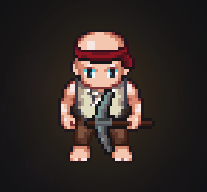

# TheDiggerMan

<div align="center">
  
  
  **An incremental clicker game built for Reddit**

  [](https://developers.reddit.com/)
  [](https://kiro.ai/)
  [](https://www.typescriptlang.org/)
  [](https://react.dev/)
</div>

## Overview

TheDiggerMan is an incremental clicker game where players dig deep into the earth to discover ores and build their mining operation. Built for Reddit's Devvit platform using Kiro IDE, it features progressive upgrades, automated mining, and competitive leaderboards.

Players click to mine ores, upgrade their tools for better earnings, purchase auto-diggers for passive income, and compete on global leaderboards. The game includes multiple biomes, various ore types, and an achievement system.

## Technical Architecture

### Platform: Reddit Devvit

TheDiggerMan is built on Reddit's Devvit platform, which allows developers to create interactive web applications that run inside Reddit posts. Players access the game directly through Reddit's interface.

### Technology Stack

#### Frontend (Client)
- **React 19** - Modern UI framework with hooks
- **TypeScript 5.8** - Type-safe development
- **Vite** - Lightning-fast build tool and dev server
- **Tailwind CSS** - Utility-first styling framework
- **Custom CSS** - Game-specific animations and effects

#### Backend (Server)
- **Express.js** - Serverless HTTP framework
- **Node.js 22** - JavaScript runtime
- **Redis** - High-performance data storage
- **Devvit APIs** - Reddit integration and authentication

#### Build System
- **Vite** - Handles both client and server compilation
- **TypeScript Project References** - Modular compilation
- **ESLint + Prettier** - Code quality and formatting
- **Devvit CLI** - Deployment and testing tools

### Project Structure

```
TheDiggerMan/
├── src/
│   ├── client/                 # React frontend (game UI)
│   │   ├── App.tsx            # Main game component & state management
│   │   ├── gameData.ts        # Game configuration (ores, tools, biomes)
│   │   ├── achievements.ts    # Achievement definitions & logic
│   │   ├── apiClient.ts       # Server communication layer
│   │   ├── Character.tsx      # Animated player sprite
│   │   ├── Modal.tsx          # Reusable modal component
│   │   ├── AchievementsModal.tsx
│   │   ├── AchievementToast.tsx
│   │   ├── styles.css         # Game styling & animations
│   │   └── public/            # Static assets
│   │       ├── ores/          # Ore sprite images
│   │       ├── smash-tools/   # Tool sprite sheets
│   │       ├── auto-diggers/  # Auto-digger images
│   │       └── sounds/        # Audio files
│   ├── server/                # Express backend
│   │   ├── index.ts          # API routes & Redis operations
│   │   └── core/post.ts      # Post creation utilities
│   └── shared/               # Shared TypeScript types
├── assets/                   # App-level assets (icons, splash)
├── devvit.json              # Devvit configuration
└── package.json             # Dependencies & build scripts
```

### Data Architecture

#### Game State Management
All game state is managed in React using hooks:

```typescript
interface GameState {
  depth: number;                    // Current dig depth
  money: number;                    // Total money earned
  totalClicks: number;              // Lifetime clicks
  currentTool: string;              // Active tool ID
  oreInventory: { [key: string]: number };     // Ore collection
  autoDiggers: { [key: string]: number };     // Auto-digger counts
  discoveredOres: Set<string>;      // Unlocked ore types
  discoveredBiomes: Set<number>;    // Unlocked biomes
  unlockedAchievements: Set<string>; // Achievement progress
  playerName: string;               // Reddit username
}
```

#### Redis Data Storage
Game data persists in Redis with post-scoped keys:

```
gameState:{postId}:{userId}           # Individual player progress
leaderboard:{postId}:money           # Money leaderboard (sorted set)
leaderboard:{postId}:depth           # Depth leaderboard (sorted set)  
leaderboard:{postId}:name            # Username reservations (hash)
stats:{postId}:globalClicks          # Global click counter
```

#### API Endpoints
The server exposes RESTful endpoints:

- `GET /api/init` - Load game state, leaderboards, player standing
- `POST /api/save` - Save game state, update leaderboards
- `POST /api/reset` - Delete player's save data
- `POST /internal/on-app-install` - Auto-create post on app install
- `POST /internal/menu/post-create` - Manual post creation

### Performance Optimizations

#### Client-Side Performance
- **Sound Pooling**: Pre-create 10 audio instances per sound type to prevent lag during rapid clicking
- **Particle Limits**: Cap active particles (30 sparks, 40 falling ores) to maintain 60fps
- **Mobile Detection**: Disable heavy effects on touch devices
- **React Optimizations**: 
  - `useMemo` for expensive calculations (biome detection, tool filtering)
  - `useCallback` for stable function references
  - `useRef` for interval callbacks to prevent re-renders
- **Debounced Saves**: Auto-save every 30 seconds to reduce server load

#### Server-Side Performance
- **Redis Optimization**: Batch leaderboard updates in single transactions
- **Efficient Queries**: Use Redis sorted sets for O(log N) leaderboard operations
- **JSON Serialization**: Store entire game state as single JSON blob
- **Serverless Architecture**: Stateless request handling for scalability


## Development Workflow

### Local Development

1. **Fast UI Development**
   ```bash
   npm run dev:vite  # Localhost:7474 for rapid iteration
   ```

2. **Full-Stack Development**
   ```bash
   npm run dev       # Client + Server + Devvit playtest
   ```

3. **Production Build**
   ```bash
   npm run build     # Compile client and server
   ```

4. **Deployment**
   ```bash
   npm run deploy    # Upload to Reddit
   npm run launch    # Build + Deploy + Publish
   ```

### Testing Environment

Devvit automatically creates test subreddits (e.g., `r/the_diggerman_dev`) where developers can test the full game experience with Reddit integration, including:
- User authentication via Reddit accounts
- Real Redis data persistence
- Leaderboard functionality
- Post creation and management

### Code Quality

- **TypeScript**: Strict type checking across all files
- **ESLint**: Code linting with React and TypeScript rules
- **Prettier**: Consistent code formatting
- **Project References**: Modular TypeScript compilation

## Getting Started

### Prerequisites
- Node.js 22+ 
- Reddit Developer account
- Git

### Installation

1. **Clone and install**
   ```bash
   git clone <repository-url>
   cd TheDiggerMan
   npm install
   ```

2. **Login to Reddit**
   ```bash
   npm run login
   ```

3. **Start development**
   ```bash
   npm run dev
   ```

4. **Open playtest URL** (provided in terminal output)

### Available Commands

| Command | Purpose |
|---------|---------|
| `npm run dev` | Full development (client + server + Devvit) |
| `npm run dev:vite` | Fast UI development (localhost:7474) |
| `npm run build` | Production build |
| `npm run check` | Type check + lint + format |
| `npm run deploy` | Upload to Reddit |
| `npm run launch` | Build + deploy + publish |

---

**TheDiggerMan** is built with Kiro IDE and modern web technologies, optimized for Reddit's Devvit platform. The codebase demonstrates clean architecture patterns and performance optimizations for browser-based games.
